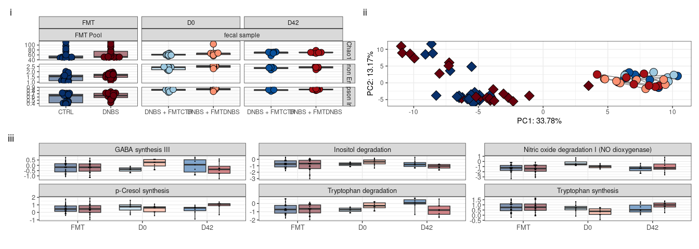

# Pathological arm

    ## [1] "Using the following formula: x ~ Treatment + Timepoint + (1 | animal_ID) + Treatment:Timepoint"
    ## [1] "Adjusting for FDR using Benjamini & Hochberg's procedure."

    ## [1] "Using the following formula: x ~ Treatment + Timepoint + (1 | animal_ID) + Treatment:Timepoint"
    ## [1] "Adjusting for FDR using Benjamini & Hochberg's procedure."

    ## [1] "Using the following formula: x ~ Treatment + Timepoint + (1 | animal_ID) + Treatment:Timepoint"
    ## [1] "Adjusting for FDR using Benjamini & Hochberg's procedure."

``` r
library(patchwork)
```

``` r
(p_alpha + p_beta + plot_layout(widths = c(3, 2)) ) / p_genus + 
  plot_layout(guides = 'collect') + 
  plot_annotation(tag_levels = "i") 
```

<!-- -->

# Therapeutic arm

    ## [1] "Using the following formula: x ~ Treatment + Timepoint + (1 | animal_ID) + Treatment:Timepoint"
    ## [1] "Adjusting for FDR using Benjamini & Hochberg's procedure."

    ## [1] "Using the following formula: x ~ Treatment + Timepoint + (1 | animal_ID) + Treatment:Timepoint"
    ## [1] "Adjusting for FDR using Benjamini & Hochberg's procedure."

    ## [1] "Using the following formula: x ~ Treatment + Timepoint + (1 | animal_ID) + Treatment:Timepoint"
    ## [1] "Adjusting for FDR using Benjamini & Hochberg's procedure."

``` r
(t_alpha + t_beta + plot_layout(widths = c(3, 2)) ) / t_GBM + 
  plot_layout(guides = 'collect') + 
  plot_annotation(tag_levels = "i") 
```

<!-- -->

``` r
# 
# t_alpha
# t_beta
# t_GBM
# t_GMM
```
