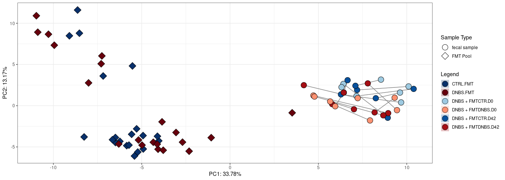
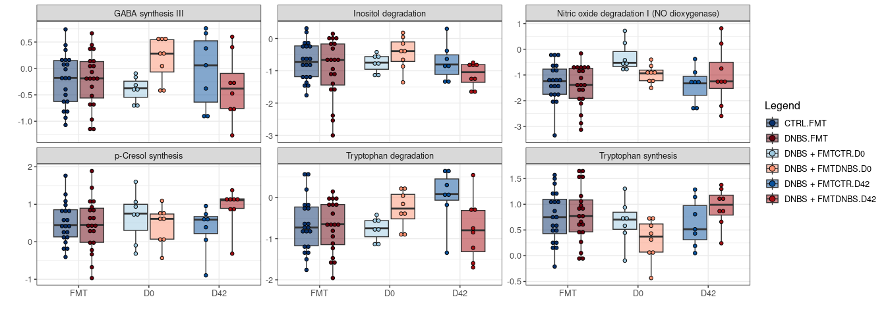
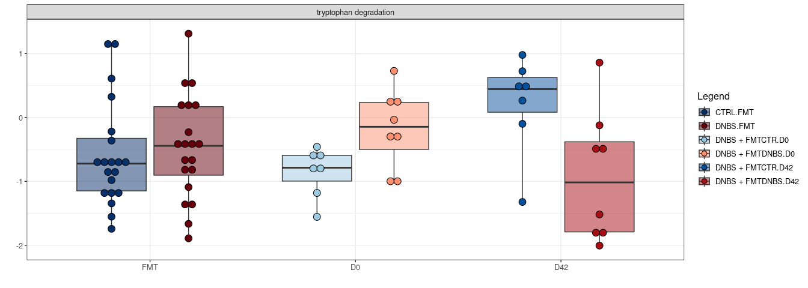

    ## [1] "Using the following formula: x ~ Treatment + Timepoint + (1 | animal_ID) + Treatment:Timepoint"
    ## [1] "Adjusting for FDR using Benjamini & Hochberg's procedure."
    ## [1] "Using the following formula: x ~ Treatment + Timepoint + (1 | animal_ID) + Treatment:Timepoint"
    ## [1] "Adjusting for FDR using Benjamini & Hochberg's procedure."
    ## [1] "Using the following formula: x ~ Treatment + Timepoint + (1 | animal_ID) + Treatment:Timepoint"
    ## [1] "Adjusting for FDR using Benjamini & Hochberg's procedure."
    ## [1] "Operating in interaction mode"
    ## [1] "94 were matched between table 1 and the columns of the adjacency matrix"
    ## [1] "786 were matched between table 2 and the rows of the adjacency matrix"
    ## [1] "Running annotation-based correlations"
    ## [1] "Running correlations for the following groups: All, abx + FMTCTR, abx + FMTDNBS"
    ## [1] "Fitting models for differential correlation testing"
    ## [1] "Model type:lm"
    ## [1] "Adjusting p-values using Benjamini & Hochberg's procedure."
    ## [1] "Using theoretical distribution."

``` r
p_alpha
```

<!-- -->

``` r
p_beta
```

<!-- -->

``` r
p_genus
```

<!-- -->

    ## [1] "Using the following formula: x ~ Treatment + Timepoint + (1 | animal_ID) + Treatment:Timepoint"
    ## [1] "Adjusting for FDR using Benjamini & Hochberg's procedure."
    ## [1] "Using the following formula: x ~ Treatment + Timepoint + (1 | animal_ID) + Treatment:Timepoint"
    ## [1] "Adjusting for FDR using Benjamini & Hochberg's procedure."
    ## [1] "Using the following formula: x ~ Treatment + Timepoint + (1 | animal_ID) + Treatment:Timepoint"
    ## [1] "Adjusting for FDR using Benjamini & Hochberg's procedure."
    ## [1] "Operating in interaction mode"
    ## [1] "94 were matched between table 1 and the columns of the adjacency matrix"
    ## [1] "786 were matched between table 2 and the rows of the adjacency matrix"
    ## [1] "Running annotation-based correlations"
    ## [1] "Running correlations for the following groups: All, DNBS + FMTCTR, DNBS + FMTDNBS"
    ## [1] "Fitting models for differential correlation testing"
    ## [1] "Model type:lm"
    ## [1] "Adjusting p-values using Benjamini & Hochberg's procedure."
    ## [1] "Using theoretical distribution."

``` r
t_alpha
```

<!-- -->

``` r
t_beta
```

<!-- -->

``` r
t_GBM
```

<!-- -->

``` r
t_GMM
```

<!-- -->
